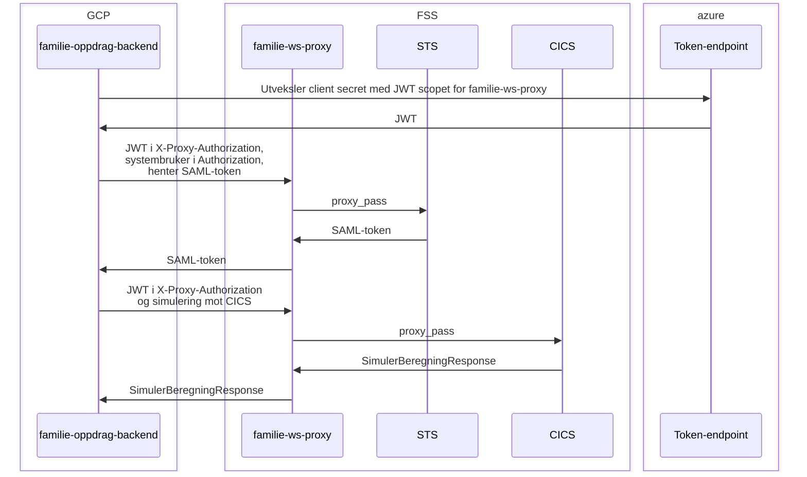

familie-ws-proxy
================

Skaper en forbindelse mellom GCP og SOAP-tjenester i FSS, slik at
`familie-oppdrag-backend` kan gjøre Simulering-kall mot Oppdrag (CICS) og hente
SAML-token fra STS.

Proxyen er en OpenResty (nginx + Lua) som kjører i FSS og videresender kall til
to tjenester:

| Sti      | Miljøvariabel   | dev-fss                       | prod-fss                |
|----------|-----------------|-------------------------------|-------------------------|
| `/sts/`  | `STS_BASE_URL`  | `https://sts-q1.preprod.local`| `https://sts.adeo.no`   |
| `/cics/` | `CICS_BASE_URL` | `https://cics-q1.adeo.no`     | `https://wasapp.adeo.no`|

## Autentisering

Alle requests må ha et Azure AD-token (client credentials, scopet mot
`familie-ws-proxy`) for at proxyen skal slippe dem gjennom. Tokenet sendes som
`X-Proxy-Authorization`-header.

Hvorfor `X-Proxy-Authorization` og ikke `Proxy-Authorization`? Fordi Java sin
`HttpClient` _fjerner_ `Proxy-Authorization` på alle HTTPS-tilkoblinger automatisk.

Konsumenter må i tillegg ligge i `accessPolicy.inbound` i `.nais/app-*.yaml`.

Proxyen validerer signatur (RS256) og at `aud` matcher `AZURE_APP_CLIENT_ID`.
Tokenet sendes ikke videre nedstrøms. Videresendte kall får med seg
`X-Azure-Client-Id` og `X-Azure-Azp-Name`.

`Authorization`-headeren videresendes uendret, slik at basic auth mot STS
(systembruker) fungerer.

## URL-er for konsumenter

STS (SAML-token for systembruker):

```
https://familie-ws-proxy.dev-fss-pub.nais.io/sts/SecurityTokenServiceProvider/
https://familie-ws-proxy.prod-fss-pub.nais.io/sts/SecurityTokenServiceProvider/
```

Simulering (CICS). Merk at stien under basen er ulik i dev og prod:

```
https://familie-ws-proxy.dev-fss-pub.nais.io/cics/oppdrag/simulerFpServiceWSBinding
https://familie-ws-proxy.prod-fss-pub.nais.io/cics/cics/services/simulerFpServiceWSBinding
```

Eksempel:

```
curl \
  -H "X-Proxy-Authorization: Bearer <azure-token>" \
  https://familie-ws-proxy.dev-fss-pub.nais.io/cics/oppdrag/simulerFpServiceWSBinding
```

`/` svarer med 200 uten autentisering og brukes som liveness/readiness.

## Flyt



## Utvikling

Bygg og valider konfigurasjonen lokalt:

```
docker build -t familie-ws-proxy .
docker run --rm --entrypoint /usr/local/openresty/bin/openresty familie-ws-proxy -t
```

Deploy skjer automatisk til dev-fss og prod-fss ved push til `main`.
